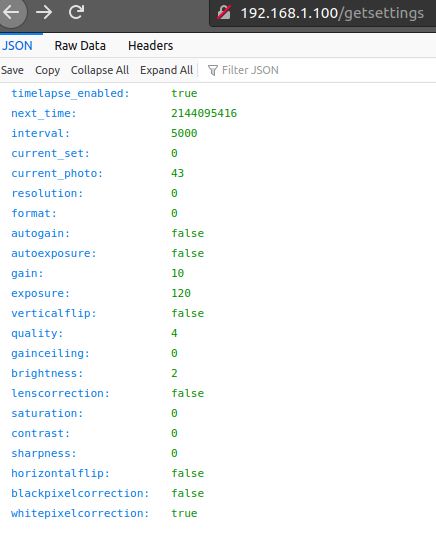

# Plantlapse

Watching plants grow

# What is this?

You can pick up an ESP32 with a camera and an SD card slot for like, six bucks, it's bananas.

With an AliExpress ESP32-Cam, this is a (potentially) great general purpose timelapse camera. Not just for plants!

Here are some features:

* A web interface to control capture / timing parameters
* Able to serve up images over the web interface to check that those parameters are good, and physically place your camera
* Able to save images to SD card
* SD card images available to download over the web interface
* Nonvolatile storage of the parameters, along with the current snapshot number, in order to gracefully recover from power failure (Planned)
* Over-the-air updating (Currently broken)
* Reasonably well-laid out codebase that's easy to hack on (Debatable)

# How does it work?

Clone, use PlatformIO, etc.

Set your WiFi credentials in `credentials.h.CHANGEME` (and change the extension to `.h`), and then flash to your ESP32-Cam.

Pointing your browser to http://plantcam.local will open up a settings page.

http://plantcam.local/now.jpg will snap a picture with the current settings and serve it up.

See [here](https://jrainimo.com/build/?p=2323) for more gratuitous words about this project.