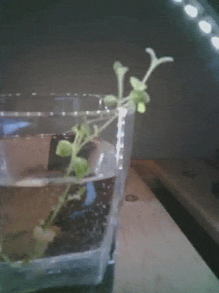
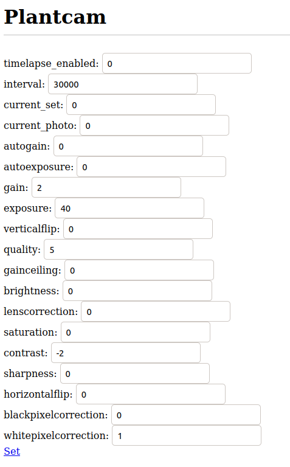
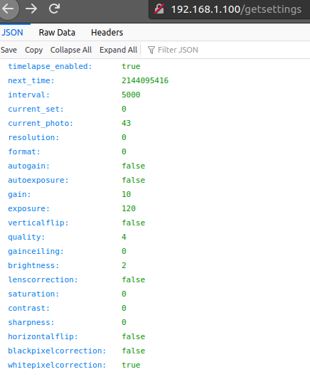
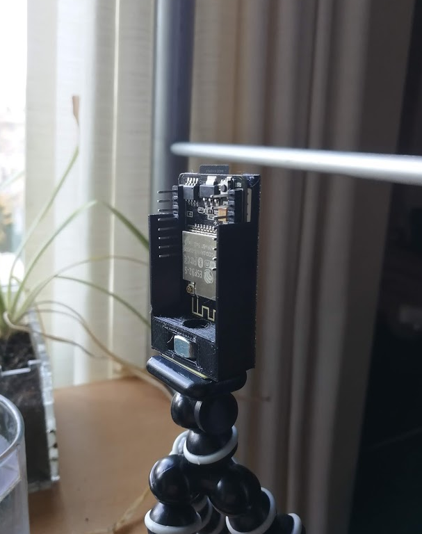
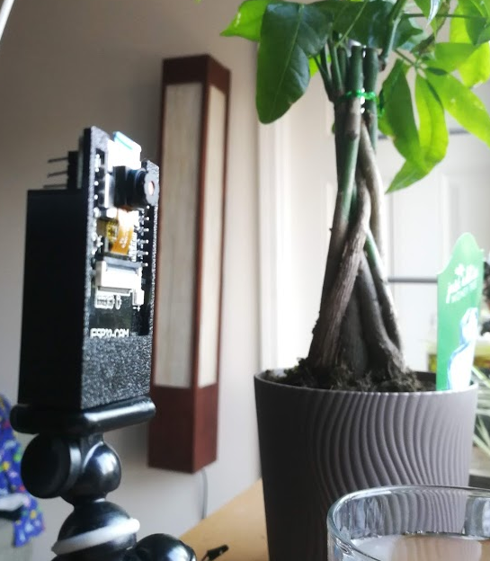

# Plantlapse

Watching plants grow

# What is this?

You can pick up an ESP32 with a camera and an SD card slot for like, six bucks, it's bananas.

With an AliExpress ESP32-Cam, this is a (potentially) great general purpose timelapse camera. Not just for plants!

Here are some features:

* A web interface to control capture / timing parameters
* Able to serve up images over the web interface to check that those parameters are good, and physically place your camera
* Able to save images to SD card
* SD card images available to download over the web interface
* Over-the-air updating
* Nonvolatile storage of the parameters, along with the current snapshot number, in order to gracefully recover from power failure (Planned)
* Reasonably well-laid out codebase that's easy to hack on (Debatable)

# Software Installation

Tested only using the ESP-IDF V4.2:

* Clone and then `make menuconfig` to set up your particular parameters.

> Serial flasher Config: 16MB flash size
>
> Partition Table: Custom
>
> Webserver Configuration: Website mount point: `/sdcard`
>
> OTA Configuation: `http://192.168.1.112:8070/plantlapse-app/build/plantlapse.bin` or similar, and check "skip server cert". Set the IP to your development PC where firmware updates will be built/hosted.
>
> Example Connection Configuration: Your wifi AP credentials
>
> ESP HTTPS OTA: Allow HTTP for OTA
> (this might be something we can work on, in the meantime, keep it within your LAN)
>
> ESP32-specific: Support for external, SPI-connected RAM
>
> Long filename support: Long filename buffer in heap

* Compile and flash to your ESP32-Cam
* Copy `index.html` to the root directory of an SD card, and then put the card into the ESP32-Cam
* Power it up, and pointing your browser to http://plantcam.local to open up a settings page, if mDNS is working on your system. Just go to the ESP32-Cam's IP address if not.

The webpage just sends JSON-formatted REST commands to the server, it's not totally necessary if there are other ways you'd prefer to interact with the REST server.

http://plantcam.local/api/get/settings will return a JSON payload of all the current settings.

http://plantcam.local/now.jpg is an image taken on startup, or if you hit the "Snap" link on the webpage.

To update firmware, start a webserver on the base directory of this repo. See `webserver.sh` for an extremely easy example, and then use the webpage to initiate the OTA process.
http://plantcam.local/api/get/ota/start is the direct link.

# Hardware Installation

There are 3D printer files for a barebones enclosure in the `3d` folder. Print the STLs, or use the STEP files for further modification. There is a slot to press a 1/4"-20 nut into, to allow this to be used on a standard tripod. Gorillapods are nice for this. All header pins, the SD card slot, and the reset button are easily accessible, and the board itself is held in with a little dab of hot glue.

# Arduino?

There is an Arduino branch of this repo, using PlatformIO. Where it fell short, though, is the lack of advanced partition configuration, and proper PSRAM support. It works well enough, but image quality and size options are more limited.

# More

See [here](https://jrainimo.com/build/?p=2323) for more gratuitous words about this project.
